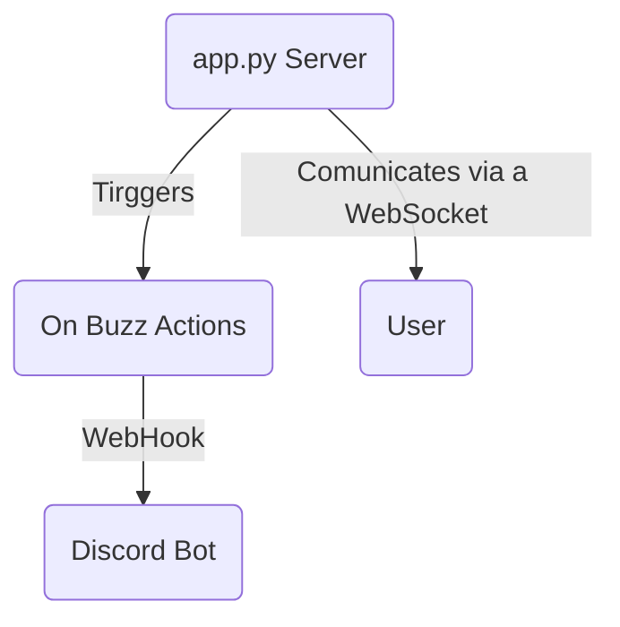

# Welcome to the BuzzerWebApp!

**BuzzerWebApp** (temporary name) is a web application which serves as a buzzer (for exemple a quizz game). Users (players) just have to log into the website to play, and when one player buzzes the others are notified, can't buzz for a certain time and this **triggers a certain action** (that will be customizable later).

# On buzz actions:

## - Discord Bot:
For the moment the only option is a **discord bot** that only let speek one player when he buzzes, in a certain voice channel (that you can setup).

## - Future options:
We plan to add several **on buzz actions**  such as:

 - An irl mode, with a presenter page.
 - Triggering any script that you want

*For the moment if you really want to play irl you can do it just by looking who has buzzed.*

# Planned additions:
*As told above, we plan to add other on buzz actions.* 
For the web app itself these are some planned additions:

 - **Rooms gestion**, for the moment you can only play one game at the same time per web server *(which is really bad)*. We plan to add a room system to allow multiple games per server.
 - **Better UI** *(in process)*, as you can see on the heroku demo the UI is very, very poor. We plan to improve this.
 - **Point counting system** 
 - **Presenter page** we plan to a dedicaded page for the game's presenter, to setup the game, trigger the point counting system...

Do not hesitate to propose additions !

# Setup:
Simply fill the `config.ini` file with your parameters and run `app.py` for the web server, and `discord_main.py` for the discord bot.

There is an **heroku** ready version in the homonym branch.

# How does it works ?

### (very) Basic diagram:

*(add information on how the code works)*
