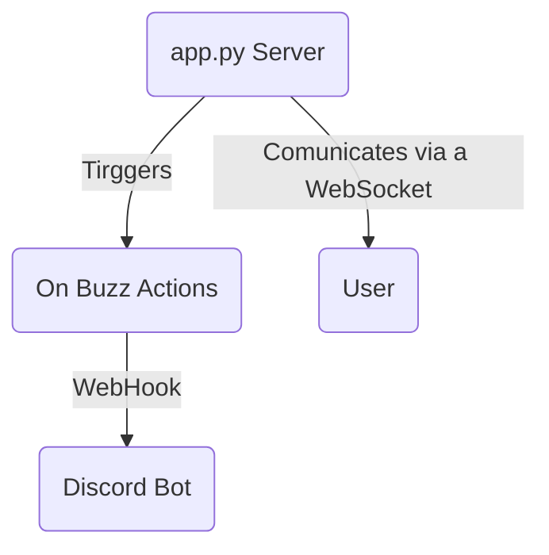

# Welcome to the BuzzerWebApp!

**BuzzerWebApp** (temporary name) is a web application which serves as a buzzer (for exemple a quizz game). Users (players) just have to log into the website to play, and when one player buzzes the others are notified, can't buzz for a certain time and this **triggers a certain action** (that will be customizable later).

# On buzz actions:

## - Discord Bot:
For the moment the only option is a **discord bot** that only let speek one player when he buzzes, in a certain voice channel (that you can setup).

## - Future options:
We plan to add several **on buzz actions**  such as:

 - An irl mode, with a presenter page.
 - Triggering any script that you want

*For the moment if you really want to play irl you can do it just by looking who has buzzed.*

# Planned additions:
*As told above, we plan to add other on buzz actions.* 
For the web app itself these are some planned additions:

 - **Rooms gestion**, for the moment you can only play one game at the same time per web server *(which is really bad)*. We plan to add a room system to allow multiple games per server.
 - **Better UI** *(in process)*, as you can see on the heroku demo the UI is very, very poor. We plan to improve this.
 - **Point counting system** 
 - **Presenter page** we plan to a dedicaded page for the game's presenter, to setup the game, trigger the point counting system...

Do not hesitate to propose additions !

# Setup:
Simply fill the `config.ini` file with your parameters and run `app.py` for the web server, and `discord_main.py` for the discord bot.

There is an **heroku** ready version in the homonym branch.

# How does it works ?

### (very) Basic diagram:
[![](https://mermaid.ink/img/eyJjb2RlIjoiZ3JhcGggVERcbkEoYXBwLnB5IFNlcnZlcikgLS1UaXJnZ2Vycy0tPiBCKE9uIEJ1enogQWN0aW9ucyk7XG5BIC0tQ29tdW5pY2F0ZXMgdmlhIGEgV2ViU29ja2V0LS0-IEMoVXNlcik7XG5CIC0tV2ViSG9vay0tPiBEKERpc2NvcmQgQm90KSIsIm1lcm1haWQiOnsidGhlbWUiOiJkZWZhdWx0IiwidGhlbWVWYXJpYWJsZXMiOnsiYmFja2dyb3VuZCI6IndoaXRlIiwicHJpbWFyeUNvbG9yIjoiI0VDRUNGRiIsInNlY29uZGFyeUNvbG9yIjoiI2ZmZmZkZSIsInRlcnRpYXJ5Q29sb3IiOiJoc2woODAsIDEwMCUsIDk2LjI3NDUwOTgwMzklKSIsInByaW1hcnlCb3JkZXJDb2xvciI6ImhzbCgyNDAsIDYwJSwgODYuMjc0NTA5ODAzOSUpIiwic2Vjb25kYXJ5Qm9yZGVyQ29sb3IiOiJoc2woNjAsIDYwJSwgODMuNTI5NDExNzY0NyUpIiwidGVydGlhcnlCb3JkZXJDb2xvciI6ImhzbCg4MCwgNjAlLCA4Ni4yNzQ1MDk4MDM5JSkiLCJwcmltYXJ5VGV4dENvbG9yIjoiIzEzMTMwMCIsInNlY29uZGFyeVRleHRDb2xvciI6IiMwMDAwMjEiLCJ0ZXJ0aWFyeVRleHRDb2xvciI6InJnYig5LjUwMDAwMDAwMDEsIDkuNTAwMDAwMDAwMSwgOS41MDAwMDAwMDAxKSIsImxpbmVDb2xvciI6IiMzMzMzMzMiLCJ0ZXh0Q29sb3IiOiIjMzMzIiwibWFpbkJrZyI6IiNFQ0VDRkYiLCJzZWNvbmRCa2ciOiIjZmZmZmRlIiwiYm9yZGVyMSI6IiM5MzcwREIiLCJib3JkZXIyIjoiI2FhYWEzMyIsImFycm93aGVhZENvbG9yIjoiIzMzMzMzMyIsImZvbnRGYW1pbHkiOiJcInRyZWJ1Y2hldCBtc1wiLCB2ZXJkYW5hLCBhcmlhbCIsImZvbnRTaXplIjoiMTZweCIsImxhYmVsQmFja2dyb3VuZCI6IiNlOGU4ZTgiLCJub2RlQmtnIjoiI0VDRUNGRiIsIm5vZGVCb3JkZXIiOiIjOTM3MERCIiwiY2x1c3RlckJrZyI6IiNmZmZmZGUiLCJjbHVzdGVyQm9yZGVyIjoiI2FhYWEzMyIsImRlZmF1bHRMaW5rQ29sb3IiOiIjMzMzMzMzIiwidGl0bGVDb2xvciI6IiMzMzMiLCJlZGdlTGFiZWxCYWNrZ3JvdW5kIjoiI2U4ZThlOCIsImFjdG9yQm9yZGVyIjoiaHNsKDI1OS42MjYxNjgyMjQzLCA1OS43NzY1MzYzMTI4JSwgODcuOTAxOTYwNzg0MyUpIiwiYWN0b3JCa2ciOiIjRUNFQ0ZGIiwiYWN0b3JUZXh0Q29sb3IiOiJibGFjayIsImFjdG9yTGluZUNvbG9yIjoiZ3JleSIsInNpZ25hbENvbG9yIjoiIzMzMyIsInNpZ25hbFRleHRDb2xvciI6IiMzMzMiLCJsYWJlbEJveEJrZ0NvbG9yIjoiI0VDRUNGRiIsImxhYmVsQm94Qm9yZGVyQ29sb3IiOiJoc2woMjU5LjYyNjE2ODIyNDMsIDU5Ljc3NjUzNjMxMjglLCA4Ny45MDE5NjA3ODQzJSkiLCJsYWJlbFRleHRDb2xvciI6ImJsYWNrIiwibG9vcFRleHRDb2xvciI6ImJsYWNrIiwibm90ZUJvcmRlckNvbG9yIjoiI2FhYWEzMyIsIm5vdGVCa2dDb2xvciI6IiNmZmY1YWQiLCJub3RlVGV4dENvbG9yIjoiYmxhY2siLCJhY3RpdmF0aW9uQm9yZGVyQ29sb3IiOiIjNjY2IiwiYWN0aXZhdGlvbkJrZ0NvbG9yIjoiI2Y0ZjRmNCIsInNlcXVlbmNlTnVtYmVyQ29sb3IiOiJ3aGl0ZSIsInNlY3Rpb25Ca2dDb2xvciI6InJnYmEoMTAyLCAxMDIsIDI1NSwgMC40OSkiLCJhbHRTZWN0aW9uQmtnQ29sb3IiOiJ3aGl0ZSIsInNlY3Rpb25Ca2dDb2xvcjIiOiIjZmZmNDAwIiwidGFza0JvcmRlckNvbG9yIjoiIzUzNGZiYyIsInRhc2tCa2dDb2xvciI6IiM4YTkwZGQiLCJ0YXNrVGV4dExpZ2h0Q29sb3IiOiJ3aGl0ZSIsInRhc2tUZXh0Q29sb3IiOiJ3aGl0ZSIsInRhc2tUZXh0RGFya0NvbG9yIjoiYmxhY2siLCJ0YXNrVGV4dE91dHNpZGVDb2xvciI6ImJsYWNrIiwidGFza1RleHRDbGlja2FibGVDb2xvciI6IiMwMDMxNjMiLCJhY3RpdmVUYXNrQm9yZGVyQ29sb3IiOiIjNTM0ZmJjIiwiYWN0aXZlVGFza0JrZ0NvbG9yIjoiI2JmYzdmZiIsImdyaWRDb2xvciI6ImxpZ2h0Z3JleSIsImRvbmVUYXNrQmtnQ29sb3IiOiJsaWdodGdyZXkiLCJkb25lVGFza0JvcmRlckNvbG9yIjoiZ3JleSIsImNyaXRCb3JkZXJDb2xvciI6IiNmZjg4ODgiLCJjcml0QmtnQ29sb3IiOiJyZWQiLCJ0b2RheUxpbmVDb2xvciI6InJlZCIsImxhYmVsQ29sb3IiOiJibGFjayIsImVycm9yQmtnQ29sb3IiOiIjNTUyMjIyIiwiZXJyb3JUZXh0Q29sb3IiOiIjNTUyMjIyIiwiY2xhc3NUZXh0IjoiIzEzMTMwMCIsImZpbGxUeXBlMCI6IiNFQ0VDRkYiLCJmaWxsVHlwZTEiOiIjZmZmZmRlIiwiZmlsbFR5cGUyIjoiaHNsKDMwNCwgMTAwJSwgOTYuMjc0NTA5ODAzOSUpIiwiZmlsbFR5cGUzIjoiaHNsKDEyNCwgMTAwJSwgOTMuNTI5NDExNzY0NyUpIiwiZmlsbFR5cGU0IjoiaHNsKDE3NiwgMTAwJSwgOTYuMjc0NTA5ODAzOSUpIiwiZmlsbFR5cGU1IjoiaHNsKC00LCAxMDAlLCA5My41Mjk0MTE3NjQ3JSkiLCJmaWxsVHlwZTYiOiJoc2woOCwgMTAwJSwgOTYuMjc0NTA5ODAzOSUpIiwiZmlsbFR5cGU3IjoiaHNsKDE4OCwgMTAwJSwgOTMuNTI5NDExNzY0NyUpIn19LCJ1cGRhdGVFZGl0b3IiOmZhbHNlfQ)](https://mermaid-js.github.io/mermaid-live-editor/#/edit/eyJjb2RlIjoiZ3JhcGggVERcbkEoYXBwLnB5IFNlcnZlcikgLS1UaXJnZ2Vycy0tPiBCKE9uIEJ1enogQWN0aW9ucyk7XG5BIC0tQ29tdW5pY2F0ZXMgdmlhIGEgV2ViU29ja2V0LS0-IEMoVXNlcik7XG5CIC0tV2ViSG9vay0tPiBEKERpc2NvcmQgQm90KSIsIm1lcm1haWQiOnsidGhlbWUiOiJkZWZhdWx0IiwidGhlbWVWYXJpYWJsZXMiOnsiYmFja2dyb3VuZCI6IndoaXRlIiwicHJpbWFyeUNvbG9yIjoiI0VDRUNGRiIsInNlY29uZGFyeUNvbG9yIjoiI2ZmZmZkZSIsInRlcnRpYXJ5Q29sb3IiOiJoc2woODAsIDEwMCUsIDk2LjI3NDUwOTgwMzklKSIsInByaW1hcnlCb3JkZXJDb2xvciI6ImhzbCgyNDAsIDYwJSwgODYuMjc0NTA5ODAzOSUpIiwic2Vjb25kYXJ5Qm9yZGVyQ29sb3IiOiJoc2woNjAsIDYwJSwgODMuNTI5NDExNzY0NyUpIiwidGVydGlhcnlCb3JkZXJDb2xvciI6ImhzbCg4MCwgNjAlLCA4Ni4yNzQ1MDk4MDM5JSkiLCJwcmltYXJ5VGV4dENvbG9yIjoiIzEzMTMwMCIsInNlY29uZGFyeVRleHRDb2xvciI6IiMwMDAwMjEiLCJ0ZXJ0aWFyeVRleHRDb2xvciI6InJnYig5LjUwMDAwMDAwMDEsIDkuNTAwMDAwMDAwMSwgOS41MDAwMDAwMDAxKSIsImxpbmVDb2xvciI6IiMzMzMzMzMiLCJ0ZXh0Q29sb3IiOiIjMzMzIiwibWFpbkJrZyI6IiNFQ0VDRkYiLCJzZWNvbmRCa2ciOiIjZmZmZmRlIiwiYm9yZGVyMSI6IiM5MzcwREIiLCJib3JkZXIyIjoiI2FhYWEzMyIsImFycm93aGVhZENvbG9yIjoiIzMzMzMzMyIsImZvbnRGYW1pbHkiOiJcInRyZWJ1Y2hldCBtc1wiLCB2ZXJkYW5hLCBhcmlhbCIsImZvbnRTaXplIjoiMTZweCIsImxhYmVsQmFja2dyb3VuZCI6IiNlOGU4ZTgiLCJub2RlQmtnIjoiI0VDRUNGRiIsIm5vZGVCb3JkZXIiOiIjOTM3MERCIiwiY2x1c3RlckJrZyI6IiNmZmZmZGUiLCJjbHVzdGVyQm9yZGVyIjoiI2FhYWEzMyIsImRlZmF1bHRMaW5rQ29sb3IiOiIjMzMzMzMzIiwidGl0bGVDb2xvciI6IiMzMzMiLCJlZGdlTGFiZWxCYWNrZ3JvdW5kIjoiI2U4ZThlOCIsImFjdG9yQm9yZGVyIjoiaHNsKDI1OS42MjYxNjgyMjQzLCA1OS43NzY1MzYzMTI4JSwgODcuOTAxOTYwNzg0MyUpIiwiYWN0b3JCa2ciOiIjRUNFQ0ZGIiwiYWN0b3JUZXh0Q29sb3IiOiJibGFjayIsImFjdG9yTGluZUNvbG9yIjoiZ3JleSIsInNpZ25hbENvbG9yIjoiIzMzMyIsInNpZ25hbFRleHRDb2xvciI6IiMzMzMiLCJsYWJlbEJveEJrZ0NvbG9yIjoiI0VDRUNGRiIsImxhYmVsQm94Qm9yZGVyQ29sb3IiOiJoc2woMjU5LjYyNjE2ODIyNDMsIDU5Ljc3NjUzNjMxMjglLCA4Ny45MDE5NjA3ODQzJSkiLCJsYWJlbFRleHRDb2xvciI6ImJsYWNrIiwibG9vcFRleHRDb2xvciI6ImJsYWNrIiwibm90ZUJvcmRlckNvbG9yIjoiI2FhYWEzMyIsIm5vdGVCa2dDb2xvciI6IiNmZmY1YWQiLCJub3RlVGV4dENvbG9yIjoiYmxhY2siLCJhY3RpdmF0aW9uQm9yZGVyQ29sb3IiOiIjNjY2IiwiYWN0aXZhdGlvbkJrZ0NvbG9yIjoiI2Y0ZjRmNCIsInNlcXVlbmNlTnVtYmVyQ29sb3IiOiJ3aGl0ZSIsInNlY3Rpb25Ca2dDb2xvciI6InJnYmEoMTAyLCAxMDIsIDI1NSwgMC40OSkiLCJhbHRTZWN0aW9uQmtnQ29sb3IiOiJ3aGl0ZSIsInNlY3Rpb25Ca2dDb2xvcjIiOiIjZmZmNDAwIiwidGFza0JvcmRlckNvbG9yIjoiIzUzNGZiYyIsInRhc2tCa2dDb2xvciI6IiM4YTkwZGQiLCJ0YXNrVGV4dExpZ2h0Q29sb3IiOiJ3aGl0ZSIsInRhc2tUZXh0Q29sb3IiOiJ3aGl0ZSIsInRhc2tUZXh0RGFya0NvbG9yIjoiYmxhY2siLCJ0YXNrVGV4dE91dHNpZGVDb2xvciI6ImJsYWNrIiwidGFza1RleHRDbGlja2FibGVDb2xvciI6IiMwMDMxNjMiLCJhY3RpdmVUYXNrQm9yZGVyQ29sb3IiOiIjNTM0ZmJjIiwiYWN0aXZlVGFza0JrZ0NvbG9yIjoiI2JmYzdmZiIsImdyaWRDb2xvciI6ImxpZ2h0Z3JleSIsImRvbmVUYXNrQmtnQ29sb3IiOiJsaWdodGdyZXkiLCJkb25lVGFza0JvcmRlckNvbG9yIjoiZ3JleSIsImNyaXRCb3JkZXJDb2xvciI6IiNmZjg4ODgiLCJjcml0QmtnQ29sb3IiOiJyZWQiLCJ0b2RheUxpbmVDb2xvciI6InJlZCIsImxhYmVsQ29sb3IiOiJibGFjayIsImVycm9yQmtnQ29sb3IiOiIjNTUyMjIyIiwiZXJyb3JUZXh0Q29sb3IiOiIjNTUyMjIyIiwiY2xhc3NUZXh0IjoiIzEzMTMwMCIsImZpbGxUeXBlMCI6IiNFQ0VDRkYiLCJmaWxsVHlwZTEiOiIjZmZmZmRlIiwiZmlsbFR5cGUyIjoiaHNsKDMwNCwgMTAwJSwgOTYuMjc0NTA5ODAzOSUpIiwiZmlsbFR5cGUzIjoiaHNsKDEyNCwgMTAwJSwgOTMuNTI5NDExNzY0NyUpIiwiZmlsbFR5cGU0IjoiaHNsKDE3NiwgMTAwJSwgOTYuMjc0NTA5ODAzOSUpIiwiZmlsbFR5cGU1IjoiaHNsKC00LCAxMDAlLCA5My41Mjk0MTE3NjQ3JSkiLCJmaWxsVHlwZTYiOiJoc2woOCwgMTAwJSwgOTYuMjc0NTA5ODAzOSUpIiwiZmlsbFR5cGU3IjoiaHNsKDE4OCwgMTAwJSwgOTMuNTI5NDExNzY0NyUpIn19LCJ1cGRhdGVFZGl0b3IiOmZhbHNlfQ)

*(add information on how the code works)*
